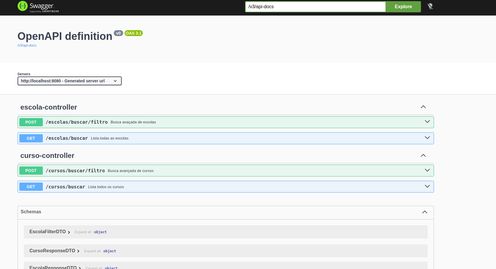

# 🏫 Escola Aberta API


> Sistema de geolocalização e consulta de cursos técnicos para a rede de ensino estadual.

O **Escola Aberta** é uma API REST desenvolvida para facilitar o acesso à informação sobre cursos técnicos oferecidos em diferentes unidades escolares. O projeto utiliza buscas dinâmicas para permitir que o usuário encontre cursos por nome, bairro ou instituição.

### 🛠️ Funcionalidades Principais
- [x] **Busca Dinâmica**: Filtros avançados com JPA Specifications (Ignora case e acentos).
- [x] **Geolocalização**: Integração de endereços de escolas.
- [x] **Documentação Automática**: Swagger UI configurado para testes em tempo real.
- [x] **Relacionamentos Complexos**: Gerenciamento eficiente de Escolas ↔ Cursos.

---

## 💻 Visualização da API (Swagger)



---

## 📂 Estrutura do Projeto

```text
src/main/java/com/marlebas/escolaaberta/
├── controllers/    # Camada de exposição dos Endpoints
├── dtos/           # Objetos de transferência (Records)
├── models/         # Entidades do Banco de Dados
├── repositories/   # Interfaces JpaRepository
├── services/       # Regras de negócio e lógica de filtros
└── specs/          # Lógica das Specifications (Queries Dinâmicas)

---

**📖 Exemplo de Uso (Filtro de Cursos)**

---

Requisição: http://localhost:8080/cursos/buscar/filtro

body:
{
  "nomeCurso" = "enfermagem"
}

Resposta: JSON

[
  {
    "id": 1,
    "nomeCurso": "Técnico em Enfermagem",
    "escola": {
      "nome": "Escola Estadual Central",
      "bairro": "Centro"
    }
  }
]

---

👨‍💻 Autor

---

**Criado por [Marlon dos Santos Santana de Jesus] – linkedin.com/in/marlonjesus**
